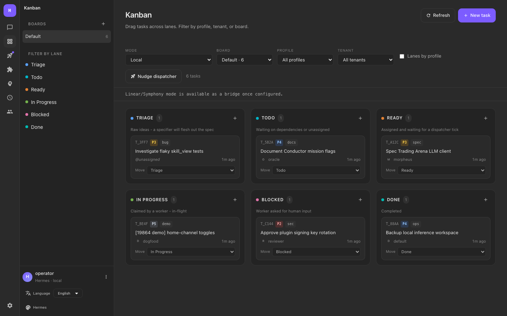
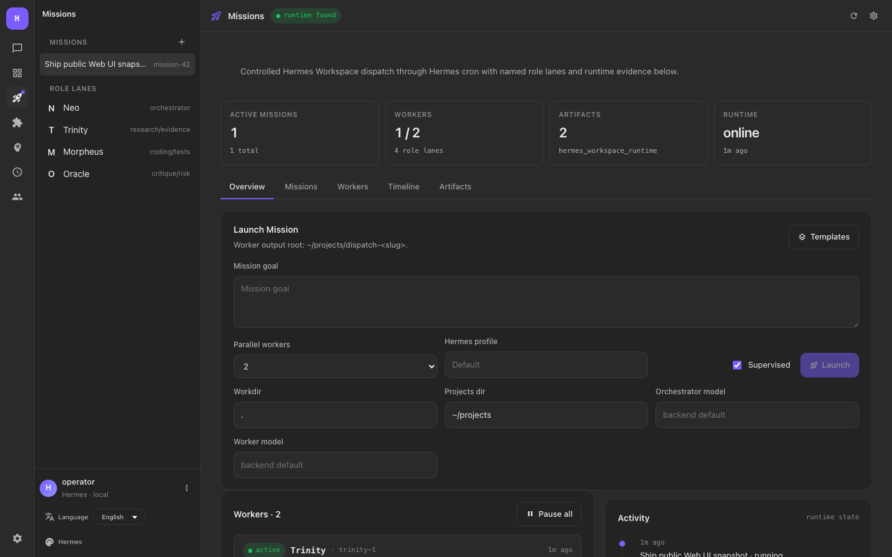
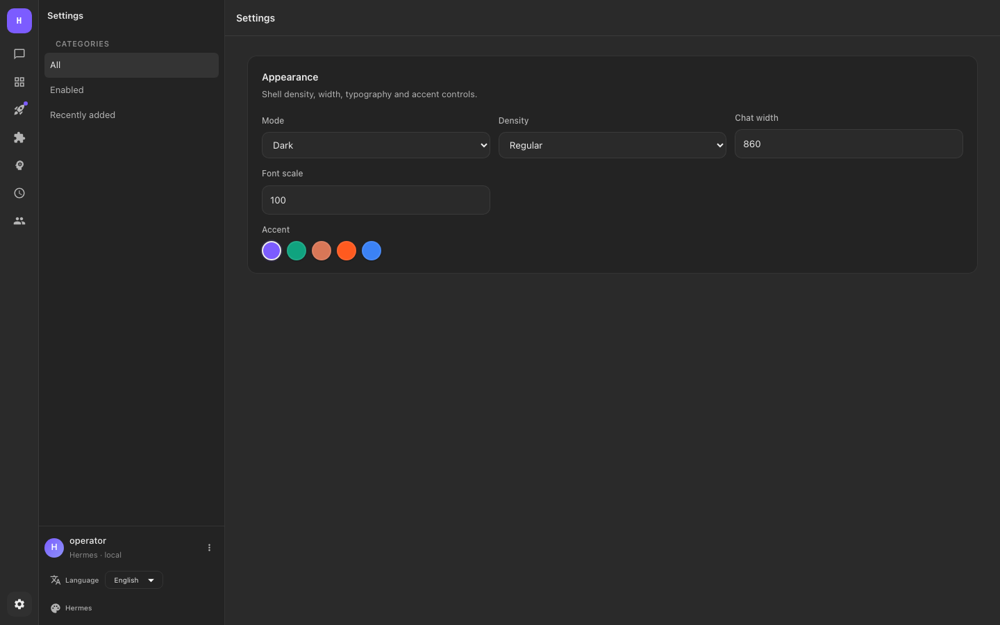

# Hermes Mission Control

A polished local web command center for [Hermes Agent](https://github.com/NousResearch/hermes-agent): chat continuity, mission dispatch, Kanban planning, cron automation, skills, plugins, profiles, and a clean desktop-style shell.

Hermes Mission Control is built for people who use agents as a real workspace, not as a toy chat box. It keeps Hermes' local-first behavior and wraps it in a fast web UI with a native-feeling sidebar, compact tool/thought traces, and mission-oriented controls.



## Highlights

- **Reference-style shell** - dark native-feeling workspace with rail navigation, contextual sidebars, fixed agent dock, and compact controls.
- **Hermes chat continuity** - conversations are discovered from Hermes state first, with JSON session fallback for older installs.
- **Collapsed reasoning and tools** - thought summaries and tool calls are hidden by default, expand as a group, and allow each tool to open individually.
- **Mission workspace** - launch Hermes Workspace-style missions through cron-backed dispatch controls with role lanes for Neo, Trinity, Morpheus, and Oracle.
- **Kanban planner** - local task board with canonical lanes, optimistic create/move UX, counts, filters, and a future Linear/Symphony bridge mode.
- **Cron, skills, and plugins** - manage recurring prompts, Hermes skill inventory, and plugin toggles from the same shell.
- **Installable PWA** - run it as a standalone local desktop app in Chromium-based browsers.





## Requirements

- Node.js 18+
- npm
- Hermes Agent installed and available as `hermes` on your `PATH`

Check Hermes first:

```bash
hermes --version
hermes status
```

## Quick Start

```bash
git clone https://github.com/MartinCampbell1/hermes-mission-control.git
cd hermes-mission-control
npm start
```

`npm start` builds the client and API, installs a local runtime under `~/.hermes_client`, and starts the local services.

| Service | URL |
| --- | --- |
| Web UI | http://localhost:18888 |
| API | http://localhost:18889 |
| API docs | http://localhost:18889/api/docs in development mode |

For development:

```bash
npm run dev
```

## First Login

On first startup the app creates a local admin user if no active user exists.
The email defaults to `admin@local.hermes`; the password is generated locally by `npm run setup` / `npm start` and stored only in `api/.env` or the installed runtime env as `HERMES_CLIENT_BOOTSTRAP_PASSWORD`.

For any real daily setup, create your own user immediately and rotate or disable the bootstrap account.

## Commands

After installation, the local CLI shim is available:

| Command | Description |
| --- | --- |
| `hermes_client start` | Start the installed local service |
| `hermes_client stop` | Stop the installed local service |
| `hermes_client restart` | Restart the installed local service |
| `hermes_client status` | Show process and port status |
| `hermes_client uninstall` | Remove autostart and app files, keeping the database |
| `hermes_client uninstall --purge` | Remove app files and local database after confirmation |

## Configuration

User-level ports live in:

```text
~/.hermes_client/.env
```

API settings can be generated with:

```bash
npm run setup
```

Useful environment variables:

| Variable | Purpose |
| --- | --- |
| `HERMES_BIN` | Absolute path to the Hermes CLI when it is not on `PATH` |
| `HERMES_HOME` | Override Hermes home, defaulting to `~/.hermes` |
| `HERMES_CLIENT_UPLOADS_DIR` | Override where uploaded files are stored |
| `HERMES_GATEWAY_URL` | Optional gateway-compatible fallback for imported API sessions |
| `HERMES_WORKSPACE_ROOT` | Workspace runtime root for mission state |
| `HERMES_CLIENT_WORKDIR` | Default working directory for launched missions |
| `HERMES_PROJECTS_DIR` | Default project output directory for missions |
| `LINEAR_API_KEY` | Optional Linear integration key for bridge-mode experiments |
| `HERMES_ENABLE_LINEAR_SYMPHONY_KANBAN=1` | Enables the Linear/Symphony Kanban mode when configured |

Generated secrets such as `JWT_SECRET` are created locally and must not be committed.

## Public-Repo Safety

This repository is intended to be source-only:

- no `.env` files;
- no SQLite databases;
- no `node_modules`;
- no generated `client/dist`;
- no QA videos or local browser artifacts;
- no `.symphony` runtime state;
- no Hermes private state from `~/.hermes`.

Before publishing a release snapshot, run:

```bash
npm --prefix client run build
npm --prefix client run test:unit
npm --prefix api test
npm run qa:browser
npm run qa:ux
npm run qa:video-proof
```

## Architecture

```text
Browser / PWA
  -> React + RTK Query client
  -> Express API
  -> SQLite UI metadata
  -> Hermes CLI, state.db, sessions, skills, plugins, cron
```

The UI does not replace Hermes. It is a local control surface around Hermes' existing state and commands.

## License

MIT. This project preserves the upstream MIT license notice.
